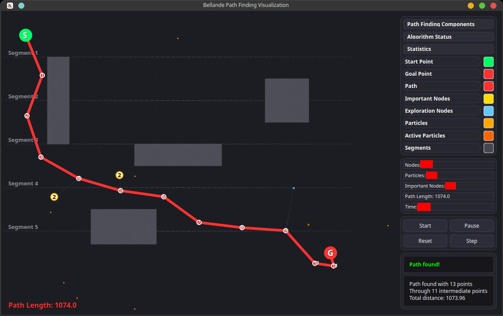

# 📦 Bellande Search Path API
## Multi-Dimensional/Infinity-Dimensional Search Path
- Use Bellande API's to get the result below

# Bellande Application 
- ```One of the features of Bellande Application is to install API's and use API locally without internet for Robotic Purposes or other Applications```


# BSP(Bellande Search Path) Algorithm API
## Bellande Step Calculations
- https://git.bellande-technologies.com/BRSRI/bellande_step
- https://github.com/Robotics-Sensors/bellande_step
- https://gitlab.com/Bellande-Robotics-Sensors-Research-Innovation-Center/bellande_step
- https://bitbucket.org/bellande-robotics-sensors/bellande_step

## Bellande Limit Calculations
- https://git.bellande-technologies.com/BRSRI/bellande_limit
- https://github.com/Robotics-Sensors/bellande_limit
- https://gitlab.com/Bellande-Robotics-Sensors-Research-Innovation-Center/bellande_limit
- https://bitbucket.org/bellande-robotics-sensors/bellande_limit

## Bellande Node Importance Calculations
- https://git.bellande-technologies.com/BRSRI/bellande_node_importance
- https://github.com/Robotics-Sensors/bellande_node_importance
- https://gitlab.com/Bellande-Robotics-Sensors-Research-Innovation-Center/bellande_node_importance
- https://bitbucket.org/bellande-robotics-sensors/bellande_node_importance

## Bellande Particles Calculations
- https://git.bellande-technologies.com/BRSRI/bellande_particle
- https://github.com/Robotics-Sensors/bellande_particle
- https://gitlab.com/Bellande-Robotics-Sensors-Research-Innovation-Center/bellande_particle
- https://bitbucket.org/bellande-robotics-sensors/bellande_particle

## Bellande Probability Calculations
- https://git.bellande-technologies.com/BRSRI/bellande_probability
- https://github.com/Robotics-Sensors/bellande_probability
- https://gitlab.com/Bellande-Robotics-Sensors-Research-Innovation-Center/bellande_probability
- https://bitbucket.org/bellande-robotics-sensors/bellande_probability

## Bellande Tree Calculations
- https://git.bellande-technologies.com/BRSRI/bellande_tree
- https://github.com/Robotics-Sensors/bellande_tree
- https://gitlab.com/Bellande-Robotics-Sensors-Research-Innovation-Center/bellande_tree
- https://bitbucket.org/bellande-robotics-sensors/bellande_tree

## Bellande Segment Calculations
- https://git.bellande-technologies.com/BRSRI/bellande_segment
- https://github.com/Robotics-Sensors/bellande_segment
- https://gitlab.com/Bellande-Robotics-Sensors-Research-Innovation-Center/bellande_segment
- https://bitbucket.org/bellande-robotics-sensors/bellande_segment

## Bellande Search Path Calculations
- https://git.bellande-technologies.com/BRSRI/bellande_search_path
- https://github.com/Robotics-Sensors/bellande_search_path
- https://gitlab.com/Bellande-Robotics-Sensors-Research-Innovation-Center/bellande_search_path
- https://bitbucket.org/bellande-robotics-sensors/bellande_search_path

## Images


## Video/Gif


# Check Out Research Organization for open-source/semi-open-source API
- https://robotics-sensors.github.io
- Check out website for more information avaliable open-source API 

# API in api_docs
- .....
- Infinity-Dimention Space

# Can also checkout portion of the docs at [Portion API DOCS](https://github.com/Robotics-Sensors/bellande_search/blob/main/api_docs.md)

## License
This Algorithm or Models is distributed under the [Creative Commons Attribution-ShareAlike 4.0 International License](http://creativecommons.org/licenses/by-sa/4.0/), see [LICENSE](https://github.com/RonaldsonBellande/bellande_search_path/blob/main/LICENSE) and [NOTICE](https://github.com/RonaldsonBellande/bellande_search_path/blob/main/LICENSE) for more information.
